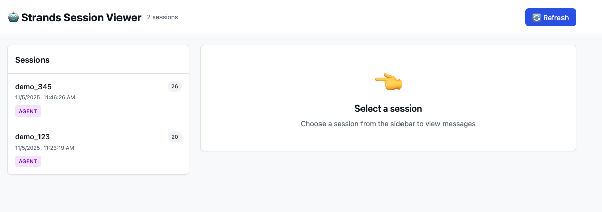
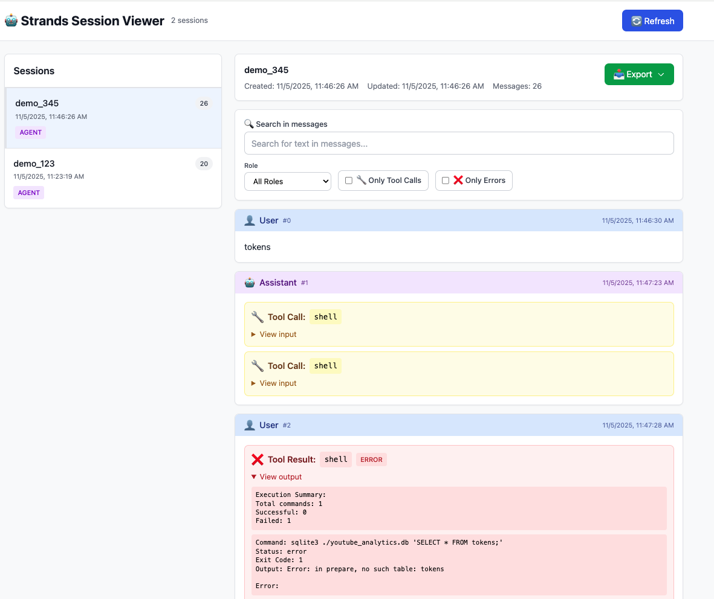

# Strands Session Viewer

[](https://github.com/labeveryday/strands-session-viewer/actions)
[](https://github.com/psf/black)
[](https://opensource.org/licenses/MIT)

A clean, browser-based viewer for [Strands](https://github.com/strands-agents/sdk-python) agent sessions. View your agent conversations, tool calls, and results in an intuitive web interface - now with **AI-powered analysis** using Strands agents.

Perfect for debugging, teaching, and understanding how your AI agents work.

## What It Does

When you use Strands' `FileSessionManager`, all your agent conversations are automatically saved to your local filesystem as JSON files. Each session includes the full conversation history, tool calls, and results - but they're stored in a raw JSON format that's difficult to read and navigate.

This viewer provides a beautiful web interface to browse and explore those locally stored sessions. Just point it at your sessions directory, and you can:
- Browse all your agent sessions in one place
- See the full conversation flow with proper formatting
- Understand what tools your agent called and why
- Export sessions for documentation or sharing

No need to manually parse JSON files or write custom scripts - just launch the viewer and start exploring your agent's behavior.

**Learn more**: [Strands Session Management Documentation](https://strandsagents.com/latest/documentation/docs/user-guide/concepts/agents/session-management/)



## Features

### Core Features
- 📋 **Session Browser** - List and browse all your agent sessions
- 💬 **Message Timeline** - View full conversation flow chronologically
- 🔧 **Tool Call Visualization** - See tool calls and their results clearly
- 🔍 **Search & Filter** - Find messages by content, role, or tool usage
- ❌ **Error Highlighting** - Quickly spot failed tool executions
- 📥 **Export Sessions** - Download as Markdown, JSON, or plain text
- 🎨 **Clean UI** - Modern interface built with Tailwind CSS
- ⚡ **Fast & Lightweight** - No build process, runs instantly
- 🔄 **Real-time Refresh** - Reload sessions to see new messages

### AI-Powered Analysis (Optional)
- 🤖 **AI Session Summaries** - Get instant AI-generated summaries of your sessions
- 🔍 **Error Analysis** - AI-powered debugging and error explanations
- 💡 **Improvement Suggestions** - Get recommendations to optimize your agents
- 💬 **Interactive Q&A** - Ask questions about sessions and get AI answers
- 🧠 **Powered by Strands** - Uses Strands agents for consistent, high-quality analysis

## Quick Start

### Installation

```bash
# Install directly from GitHub
pip install git+https://github.com/labeveryday/strands-session-viewer.git
```

### Usage

```bash
# View sessions in ./sessions directory
strands-viewer

# Or specify a custom directory
strands-viewer /path/to/your/sessions

# Use a different port
strands-viewer --port 8080

# Use OpenAI for AI analysis
strands-viewer --model-provider openai --model-id gpt-5-mini-2025-08-07

# Use Ollama for AI analysis (local)
strands-viewer --model-provider ollama --model-id qwen3:4b

# See all options
strands-viewer --help
```

The viewer will automatically open in your browser at `http://localhost:8000`

**To stop the server:** Press `Ctrl+C` (or `Command+C` on Mac) in the terminal where it's running.

## AI-Powered Session Analysis

Enhance your debugging with AI-powered analysis using Strands agents. The viewer can automatically analyze your sessions, explain errors, suggest improvements, and answer questions about agent behavior.

### Installation

To enable AI analysis features, install with the `ai` extra:

```bash
pip install 'strands-session-viewer[ai]' git+https://github.com/labeveryday/strands-session-viewer.git
```

This installs the `strands-agents` package, which powers the AI analysis features.

### Configuration

AI analysis supports multiple model providers:

#### **Anthropic** (Default - uses Bedrock)

```bash
# Configure AWS credentials for Bedrock
export AWS_ACCESS_KEY_ID="your-access-key"
export AWS_SECRET_ACCESS_KEY="your-secret-key"
export AWS_REGION="us-east-1"  # Optional, defaults to us-east-1

# Or use Anthropic API directly
export ANTHROPIC_API_KEY="your-api-key"

# Launch with Anthropic model
strands-viewer --model-provider anthropic --model-id claude-sonnet-4-5-20250929
```

#### **OpenAI**

```bash
# Configure OpenAI API key
export OPENAI_API_KEY="your-api-key"

# Launch with OpenAI model
strands-viewer --model-provider openai --model-id gpt-5-mini-2025-08-07
```

#### **Ollama** (Local)

```bash
# Configure Ollama host (optional, defaults to localhost)
export OLLAMA_HOST="http://localhost:11434"

# Launch with Ollama model
strands-viewer --model-provider ollama --model-id qwen3:4b
```

**Learn more**: [Strands Quickstart Guide](https://strandsagents.com/latest/documentation/docs/user-guide/quickstart/)

### Features

Once configured, you'll see an **AI Session Analysis** panel when viewing any session:

#### Quick Analysis
- **📊 Summarize** - Get an AI-generated summary of the entire session
- **❌ Analyze Errors** - Understand what went wrong and why
- **💡 Suggest Improvements** - Get recommendations to optimize your agent

#### Interactive Chat
Ask questions about the session and get instant AI-powered answers:
- "Why did this tool call fail?"
- "How could this agent be more efficient?"
- "What was the agent trying to accomplish here?"
- "Are there any security concerns in this session?"

The AI maintains conversation history, so you can have a back-and-forth dialogue about your sessions.

### Example Workflow

```bash
# 1. Install with AI support
pip install 'strands-session-viewer[ai]' git+https://github.com/labeveryday/strands-session-viewer.git

# 2. Configure AWS credentials
export AWS_ACCESS_KEY_ID="your-key"
export AWS_SECRET_ACCESS_KEY="your-secret"

# 3. Launch viewer
strands-viewer

# 4. Select a session and use the AI Analysis panel
```

### No AI? No Problem

The AI features are completely optional. Without the `ai` extra installed, the viewer works perfectly for browsing and exporting sessions - you just won't see the AI Analysis panel.

## Interface Overview



### Session List (Left Sidebar)
- Click any session to view its messages
- Shows message count and last update time
- Sessions sorted by most recent first

### Message View (Main Panel)
- **User messages** (blue) - Your prompts to the agent
- **Assistant messages** (purple) - Agent responses
- **Tool calls** (yellow) - Tools the agent invoked
- **Tool results** (green/red) - Successful or failed tool outputs

### Filters & Search
- **Search** - Find text in messages, tool names, or outputs
- **Role Filter** - Show only user or assistant messages
- **Tool Calls** - Show only messages with tool usage
- **Errors** - Show only failed tool executions

### Export Options
- **Markdown** - Perfect for documentation and course materials
- **JSON** - For programmatic analysis and archiving
- **Plain Text** - Simple, readable format for sharing

## Use Cases

### For Developers
- Debug agent behavior and tool usage
- Track token usage and performance
- Understand conversation flow
- Spot errors and failures quickly

### For Teachers
- Show students how agents work
- Demonstrate tool calling in action
- Compare different agent runs
- Create course materials from sessions

### For Researchers
- Analyze agent decision-making
- Study tool usage patterns
- Export sessions for documentation
- Share results with collaborators

## Project Structure

```
strands-session-viewer/
├── src/
│   └── strands_viewer/
│       ├── __init__.py         # Package initialization
│       ├── __version__.py      # Version info
│       ├── cli.py              # Command-line interface
│       ├── server.py           # FastAPI server
│       ├── session_reader.py   # Session file parser
│       ├── export_formatter.py # Export formatters (Markdown, JSON, text)
│       ├── ai_analysis.py      # Session analysis with intelligent tools
│       ├── models/             # Model provider configurations
│       │   ├── __init__.py
│       │   └── models.py       # Factory functions for Anthropic, OpenAI, Ollama
│       └── static/
│           └── index.html      # Web interface
├── tests/                      # Test suite
├── pyproject.toml             # Package configuration
├── CHANGELOG.md               # Version history
├── CLAUDE.md                  # Development notes
├── LICENSE                    # MIT License
└── README.md                 # This file
```

## Requirements

- Python 3.8+
- FastAPI
- Uvicorn

Dependencies are automatically installed with the package.

## API Endpoints

The viewer exposes a REST API:

### Core Endpoints
- `GET /api/sessions` - List all sessions
- `GET /api/sessions/{session_id}` - Get session details
- `GET /api/sessions/{session_id}/messages` - Get session messages (with pagination)
- `GET /api/sessions/{session_id}/export?format=markdown` - Export session (formats: markdown, json, text)

### Analysis Endpoints (Optional)
- `GET /api/ai/status` - Check if analysis features are available
- `POST /api/sessions/{session_id}/analyze` - Run analysis (types: summarize, errors, improvements)
- `POST /api/sessions/{session_id}/chat` - Interactive Q&A about session

## Development

### Local Development Setup

```bash
# Clone the repository
git clone https://github.com/labeveryday/strands-session-viewer.git
cd strands-session-viewer

# Install in development mode
pip install -e .

# Or with dev dependencies (recommended)
pip install -e ".[dev]"

# Run tests
pytest

# Run tests with coverage
pytest --cov=strands_viewer --cov-report=html
```

### Run from Source

```bash
python -m strands_viewer.cli --dir ./sessions
```

## Tech Stack

- **Backend**: FastAPI + uvicorn
- **Frontend**: HTML + Tailwind CSS (CDN) + Alpine.js (CDN)
- **No build process required!**

## Contributing

Contributions are welcome! Please feel free to submit a Pull Request.

## License

MIT License - see [LICENSE](LICENSE) file for details

## Acknowledgments

Built for the [Strands](https://github.com/strands-agents/sdk-python) agent framework.

## Links

- **GitHub**: https://github.com/labeveryday/strands-session-viewer
- **Strands SDK**: https://github.com/strands-agents/sdk-python
- **Issues**: https://github.com/labeveryday/strands-session-viewer/issues

---

Made with ❤️ for the Strands community
